# Python-Centric Cognitive Compiler
## A Memory-Augmented, Agentic, Code-Only AI System

---

## 0. Executive Overview

This document defines a **Python-centric cognitive compiler**: a purpose-built AI system that
combines compiler-style determinism with learning-based reasoning. The system is designed to:

- Generate Python code from intent-level prompts
- Transpile C, C++, and Java into **correct, idiomatic Python**
- Read, learn from, and internalize technical books and documentation
- Validate all generated Python code via hard gates
- Enter a controlled **agentic repair mode** to fix errors autonomously
- Accumulate long-term, governed knowledge through memory—not weight updates

This system is **not** a chatbot, **not** a generic LLM, and **not** a consumer AI product.
It is a **developer infrastructure component**.

---

## 1. Motivation and Differentiation

### 1.1 Limitations of Current LLMs

Frontier LLMs (GPT, Gemini, Claude) suffer from:
- Opaque reasoning
- No persistent memory
- Optional or absent validation
- Externalized agent logic
- High training and inference costs
- Weak guarantees for correctness

### 1.2 Core Insight

> Software engineering is structured, hierarchical, and verifiable.  
> AI systems for code should be built the same way.

This system enforces:
- Explicit task decomposition
- Deterministic execution
- Memory governance
- Validation-first outputs

---

## 2. System-Wide Design Principles

1. **Correctness over fluency**
2. **Validation before output**
3. **Tasks before tokens**
4. **Memory over retraining**
5. **Bounded autonomy**
6. **Explicit failure over hallucination**

---

## 3. End-to-End Architecture

```
Inputs
(Prompts | Code | HTML | Markdown | Books | Repositories)
        ↓
Edge Liquid Neural Network (LNN)
        ↓
MIRAS Controller (Task + Memory OS)
        ↓
Titans Reasoning Core (Planning + Long-Term Memory)
        ↓
Mixture of Experts (Specialized Execution)
        ↓
Python Validation & Test Pipeline
        ↓
Outputs
(Validated Python | Markdown Docs | Task Report)
```

Each layer is mandatory and observable.

---

## 4. Edge Layer: Liquid Neural Networks (LNN)

### 4.1 Purpose

The LNN acts as a **continuous-time preprocessing cortex**.

Responsibilities:
- Stabilize noisy, underspecified prompts
- Smooth vibe-based instructions
- Handle streaming inputs (books, large repos)
- Normalize error logs across iterations

### 4.2 Why LNNs

- ODE-based dynamics
- Fewer parameters than Transformers
- Naturally handle temporal drift
- Efficient on edge or low-latency paths

### 4.3 Explicit Non-Responsibilities

- No planning
- No code generation
- No long-term memory writes

---

## 5. MIRAS: Memory & Intelligence Routing Architecture System

### 5.1 Role

MIRAS is the **cognitive operating system**.

It orchestrates all intelligence without performing intelligence itself.

### 5.2 Responsibilities

- Parse stabilized input
- Generate hierarchical task DAGs
- Validate DAG correctness (acyclic, complete)
- Select and sequence experts
- Govern all memory access
- Control agentic loops
- Enforce termination policies

### 5.3 Task DAG Model

Each task includes:
- Task ID
- Description
- Dependencies
- Assigned expert
- Validation criteria

No task may execute without DAG validation.

---

## 6. Titans Reasoning Core

### 6.1 Role

Titans is the **thinking brain**.

Capabilities:
- Long-range reasoning
- Cross-file and cross-book understanding
- Root-cause analysis of failures
- Hypothesis generation for fixes

### 6.2 Long-Term Memory

Memory is:
- Neural + associative
- Explicitly addressed
- Updated at inference time
- Governed by MIRAS

Stored knowledge includes:
- Python semantics
- Transpilation idioms
- Known error/fix pairs
- Abstracted algorithms
- Design invariants

### 6.3 Memory Write Triggers

- High prediction surprise
- Validation failures
- Successful agentic fixes
- Repeated task patterns

---

## 7. Mixture of Experts (MoE)

### 7.1 Rationale

Specialization beats scale for code.

Experts are:
- Smaller than a full LLM
- Easier to train
- Easier to replace
- Easier to audit

### 7.2 Canonical Experts

- Python Code Generation Expert
- C Semantic Extractor
- C++ Semantic Extractor
- Java Semantic Extractor
- IR → Python Transpiler
- HTML Parser
- Markdown Generator
- Python Validation Expert

### 7.3 Expert Constraints

- Stateless
- Deterministic
- No memory writes
- Task-scoped inputs only

---

## 8. Python as Canonical Target Language

### 8.1 Why Python

- Fast iteration
- Rich tooling ecosystem
- Ideal for agentic repair
- Human-readable output

### 8.2 Transpilation Philosophy

- Preserve behavior, not structure
- Prefer readability
- Avoid unsafe constructs
- Surface ambiguity explicitly

---

## 9. Intermediate Representation (IR)

All source languages compile into a **language-neutral IR**.

IR properties:
- Control-flow explicit
- Exceptions explicit
- Types optional but annotated
- Language-agnostic semantics

This decouples source parsing from Python generation.

---

## 10. Agentic Execution Mode

### 10.1 Definition

Agentic mode is a **bounded, goal-directed execution loop**.

Triggered when:
- Validation fails
- Tests fail
- Runtime exceptions occur

### 10.2 Loop Structure

```
Detect error
 → Analyze root cause
 → Generate fix task
 → Apply minimal patch
 → Re-validate
 → Stop on success or limit
```

### 10.3 Safety Constraints

- Max iterations
- Max modified files
- Max memory updates
- Full audit trail

---

## 11. Python Validation Pipeline (Hard Gate)

Validation layers (strict order):

1. Syntax (`py_compile`)
2. Import resolution
3. AST integrity
4. Static analysis
5. Runtime execution (sandboxed)
6. Test execution (`pytest`)

No output bypasses validation.

---

## 12. Training Methodology (Deep Dive)

### 12.1 Edge LNN Training

- Self-supervised temporal consistency
- Noise-robust objectives
- Small datasets sufficient

### 12.2 Titans Core Training

**Phase 1**: Python language modeling  
**Phase 2**: Long-context repository training  
**Phase 3**: Memory-in-the-loop training with surprise gating

### 12.3 Transpilation Training

- Source → IR (supervised)
- IR → Python (supervised)
- Validation-feedback fine-tuning

### 12.4 Task Decomposition Training

- Prompt → DAG datasets
- Software design documents
- Issue-to-fix traces

### 12.5 Runtime Learning

- Memory updates only
- No weight changes
- Retention governed by policy

---

## 13. Source Code Architecture

```
core/        runtime, task DAGs, ledgers
lnn/         liquid neural networks
miras/       controller, scheduler, memory policy
titans/      reasoning core, neural memory
experts/     MoE execution units
agentic/     repair and fix loops
training/    offline training pipelines
validation/  python validation tools
```

---

## 14. Feasibility Analysis vs Frontier LLMs

| Dimension | This System | Frontier LLMs |
|--------|-------------|---------------|
| Scope | Code-only | General |
| Memory | Persistent, explicit | Implicit |
| Validation | Mandatory | Optional |
| Agentic Repair | Native | External |
| Training Cost | Low–moderate | Extremely high |
| Team Size | Small | Large labs |
| Guarantees | Strong | Weak |

**Conclusion**: This system is far more feasible for individuals or small teams.

---

## 15. System Invariants

- No unvalidated Python output
- No memory writes without MIRAS approval
- No infinite agentic loops
- No silent failures
- No expert autonomy

---

## 16. Long-Term Roadmap

- Multi-language targets beyond Python
- Formal verification hooks
- Semantic equivalence checking
- Distributed memory backends
- IDE integration

---

## 17. Final Statement

This architecture represents a **new class of AI system**:
a cognitive compiler that reasons, remembers, validates, and repairs.

It is **buildable**, **auditable**, and **strategically differentiated** from current LLMs.

---

## 18. Prospective Training Data Sources

This system deliberately avoids indiscriminate web scraping. Training data is **curated, domain-specific, and legally traceable**.
Below are recommended sources for each training component.

---

### 18.1 Python Language Modeling Data

**Primary Sources**
- CPython source code repository (stdlib, tests)
- Python Enhancement Proposals (PEPs)
- Well-maintained open-source Python projects (e.g., scientific, backend, tooling libraries)
- Python language reference documentation

**Selection Criteria**
- High test coverage
- Active maintenance
- Idiomatic Python usage
- Clear licensing (MIT, BSD, Apache-2.0)

---

### 18.2 C / C++ Source Data (for Transpilation)

**Primary Sources**
- LLVM test suites
- GNU Coreutils (C)
- SQLite source (C)
- Boost libraries (C++)
- Small, well-scoped system utilities

**Auxiliary Sources**
- Compiler test corpora
- Educational C/C++ repositories
- Verified competitive programming solutions

**Notes**
- Focus on clarity over macro-heavy code
- Prefer code with well-defined behavior

---

### 18.3 Java Source Data (for Transpilation)

**Primary Sources**
- OpenJDK standard libraries
- Apache Commons projects
- Spring framework core modules (selective)
- Java algorithm repositories

**Supporting Data**
- Java Language Specification
- JVM bytecode tests (for semantic grounding)

---

### 18.4 Parallel / Paired Transpilation Data

**Sources**
- Existing transpilers (used as noisy teachers)
- Hand-curated C/C++/Java → Python examples
- University compiler course assignments
- Code migration guides

**Augmentation**
- Synthetic variants
- Controlled mutations
- Deliberate bug injection for agentic repair training

---

### 18.5 Validation and Repair Training Data

**Sources**
- Broken open-source repositories
- Compiler error corpora
- Mutation testing frameworks
- CI failure logs (sanitized)

**Purpose**
- Train agentic repair loops
- Learn error → fix mappings
- Improve root-cause analysis

---

### 18.6 Task Decomposition Training Data

**Sources**
- Software design documents
- Issue trackers (issue → commit history)
- Pull request discussions
- Refactoring proposals

**Labeling Strategy**
- Human-curated DAGs (small set)
- Weak supervision via heuristics
- Iterative refinement

---

### 18.7 Document and Book Learning Data

**Sources**
- Programming textbooks (open-licensed)
- Language specifications
- RFCs and standards documents
- Technical blogs (selective, archived)

**Formats**
- Markdown
- HTML
- PDF (converted to Markdown)

---

### 18.8 Licensing and Compliance

All datasets must:
- Be permissively licensed or public-domain
- Be stored with provenance metadata
- Allow redistribution for research and model training

Recommended licenses:
- MIT
- BSD
- Apache-2.0
- CC-BY / CC0

---

### 18.9 Data Governance Principles

- No personal data
- No proprietary code
- No closed-source leakage
- Clear dataset versioning
- Reproducible preprocessing pipelines

---

## 19. Closing Note on Data Strategy

The **quality, structure, and legality** of training data matter more than raw scale.

By constraining the domain to code and technical documents, this system can achieve **high correctness and reliability** without web-scale data ingestion.


---

## 20. Natural Language Understanding (NLU) for Prompts

Although the system is code-centric, it must robustly understand **natural language prompts**.
This capability is explicitly engineered, not assumed.

### 20.1 Prompt Understanding Philosophy

Natural language is treated as **underspecified intent**, not executable instruction.

The system therefore:
- Extracts intent, constraints, and goals
- Separates *what* from *how*
- Converts language into structured, machine-readable representations

No prompt is executed directly.

---

### 20.2 Prompt Processing Pipeline

```
Raw Natural Language Prompt
 → Linguistic Normalization
 → Intent & Goal Extraction
 → Constraint & Vibe Detection
 → Ambiguity Identification
 → Structured Intent Graph
 → Task DAG Generation
```

This pipeline runs **before** any code generation.

---

### 20.3 Linguistic Normalization

Handled jointly by:
- Edge LNN (stability, smoothing)
- Lightweight Transformer encoder (syntax + semantics)

Responsibilities:
- Resolve references (“this”, “that”, “above”)
- Normalize tense and modality
- Remove conversational noise

---

### 20.4 Intent and Goal Extraction

The system identifies:
- Primary objective (generate, transpile, fix, document)
- Target language (Python)
- Source languages (C, C++, Java)
- Scope (single file, project, library)
- Success criteria (tests, compilation, performance)

Intent is represented as a **goal object**, not text.

---

### 20.5 Constraint and Vibe Detection

Natural language style cues (“simple”, “robust”, “production-grade”) are mapped to **explicit constraints**.

Examples:
- “robust” → error handling + validation required
- “simple” → avoid abstractions
- “fast” → prefer algorithmic clarity

Constraints never override correctness.

---

### 20.6 Ambiguity Detection and Resolution

If a prompt is ambiguous:
- MIRAS inserts clarification subtasks
- Conservative defaults are applied
- Ambiguities are logged explicitly

The system never guesses silently.

---

## 21. Multi-Pass Code Checking and Robustness Logic

Generating code once is insufficient.
This system enforces **iterative, multi-pass verification**.

---

### 21.1 Generation–Validation–Repair Loop

```
Generate Code
 → Validate
 → Diagnose Issues
 → Repair
 → Re-Validate
 → Repeat until stable or limit reached
```

This loop is mandatory even if no errors are detected initially.

---

### 21.2 Validation Pass Types

The system performs **multiple validation passes**, each with a different focus:

1. **Syntactic pass** – correctness of syntax
2. **Semantic pass** – logical consistency
3. **Structural pass** – modularity and clarity
4. **Robustness pass** – edge cases and error handling
5. **Regression pass** – ensure fixes did not break prior correctness

---

### 21.3 Cross-Expert Rechecking

After initial generation:
- A *different expert* re-evaluates the code
- Conflicting assessments trigger review tasks
- Consensus or conservative resolution is required

This prevents single-model blind spots.

---

### 21.4 Defensive Code Generation Rules

Generated Python code must:
- Validate inputs
- Handle exceptional cases explicitly
- Avoid undefined behavior
- Fail loudly rather than silently

These rules are enforced during robustness passes.

---

### 21.5 Memory-Assisted Robustness

Titans memory contributes by:
- Recalling past failure patterns
- Applying known defensive idioms
- Avoiding previously observed bugs

Only **validated fixes** are stored.

---

### 21.6 Termination Guarantees

The rechecking loop terminates when:
- All validation passes succeed
- No new issues are detected
- Iteration limits are reached

Failure to converge results in an **explicit error report**, not partial output.

---

## 22. Robustness Guarantees

With these mechanisms, the system guarantees:

- No syntactically invalid Python output
- No unresolved imports
- No unhandled runtime exceptions (within tested scope)
- Deterministic behavior under repeated execution
- Explicit reporting of any unresolved ambiguity

---

## 23. Summary of Natural Language + Robustness Enhancements

By explicitly engineering:
- Natural language understanding
- Intent extraction
- Constraint mapping
- Multi-pass validation
- Cross-expert rechecking

…the system bridges the gap between **human language** and **machine-correct code**, without relying on conversational heuristics.


---

## 24. Mixture-of-Experts (MoE): Prospective Models and Specializations

This section details **concrete model choices** and **design options** for the Mixture-of-Experts (MoE)
layer. The intent is to make MoE **practically implementable**, not abstract.

---

## 24.1 MoE Design Philosophy

The MoE layer exists to:
- Reduce training cost
- Increase correctness via specialization
- Improve debuggability
- Allow incremental upgrades

Key principle:

> **One expert = one clearly bounded competency.**

Experts are *not* generalists.

---

## 24.2 Categories of Experts

Experts fall into five broad categories:

1. Generative experts
2. Analytical experts
3. Parsing / extraction experts
4. Validation experts
5. Meta-evaluation experts

Each category may use **different model architectures**.

---

## 24.3 Python Code Generation Expert

### Role
- Generate idiomatic, readable Python
- Follow explicit constraints
- Avoid hallucinated APIs

### Prospective Model Choices
- Fine-tuned code-only Transformer (1B–7B params)
- Python-specialized GPT-style decoder
- AST-aware Transformer (encoder-decoder)

### Training Data
- High-quality Python repos
- CPython standard library
- Curated algorithm implementations

### Notes
This expert should be **conservative**, not creative.

---

## 24.4 IR → Python Transpilation Expert

### Role
- Convert semantic IR into Python
- Preserve behavior
- Apply Pythonic idioms

### Prospective Model Choices
- Encoder–decoder Transformer trained on IR–Python pairs
- Sequence-to-sequence model with structured decoding
- Hybrid model with grammar constraints

### Training Data
- Hand-curated IR → Python mappings
- Synthetic IR generated from Python code

---

## 24.5 C Semantic Extraction Expert

### Role
- Parse C source
- Emit language-neutral IR
- Resolve macros conservatively

### Prospective Model Choices
- Non-neural AST-based extractor (clang frontend)
- Lightweight Transformer over clang AST
- Hybrid symbolic + neural pipeline

### Notes
Purely symbolic approaches are preferred where possible.

---

## 24.6 C++ Semantic Extraction Expert

### Role
- Parse C++ source
- Handle templates, RAII, inheritance
- Emit simplified IR

### Prospective Model Choices
- Clang-based AST extractor + neural simplifier
- Small Transformer trained on AST normalization
- Rule-based fallback for complex templates

---

## 24.7 Java Semantic Extraction Expert

### Role
- Parse Java source
- Extract class and interface semantics
- Map JVM-style constructs to IR

### Prospective Model Choices
- javac AST frontend
- Tree-based neural encoders
- Transformer trained on Java → IR pairs

---

## 24.8 HTML Parsing Expert

### Role
- Parse technical HTML
- Extract specs, tables, code blocks
- Discard UI noise

### Prospective Model Choices
- Deterministic DOM parser + heuristics
- Small Transformer for structure classification

Neural models are optional here.

---

## 24.9 Markdown Generation Expert

### Role
- Generate deterministic Markdown
- Produce documentation
- Convert HTML → Markdown

### Prospective Model Choices
- Rule-based formatter
- Small sequence-to-sequence Transformer

This expert should be **low temperature** and highly deterministic.

---

## 24.10 Validation Expert (Python-Specific)

### Role
- Execute validation pipeline
- Normalize errors
- Produce structured diagnostics

### Prospective Model Choices
- Mostly non-neural
- ML-assisted classification for error grouping

This expert is primarily **procedural**, not generative.

---

## 24.11 Cross-Check / Critic Expert

### Role
- Independently review generated Python
- Detect logical or structural weaknesses
- Trigger re-evaluation

### Prospective Model Choices
- Smaller LLM trained for critique
- Static-analysis-assisted neural model

This expert improves robustness via redundancy.

---

## 24.12 Model Size and Compute Guidance

| Expert Type | Typical Size |
|------------|-------------|
| Python Generator | 3B–7B |
| IR → Python | 1B–3B |
| C/C++/Java Extractors | <1B or symbolic |
| Markdown / HTML | <500M |
| Critic | 1B–3B |

Total system compute is **far lower** than a single frontier LLM.

---

## 24.13 Training Independence

Each expert:
- Is trained independently
- Can be replaced without retraining others
- Shares memory only through MIRAS

This enables long-term system evolution.

---

## 24.14 Failure Isolation

If an expert fails:
- MIRAS can reroute to fallback logic
- Failures are localized
- Global system stability is preserved

---

## 24.15 Summary of MoE Strategy

By using a carefully designed Mixture-of-Experts:
- The system avoids monolithic model complexity
- Correctness improves through specialization
- Training and inference costs remain feasible
- The system remains auditable and extensible


---

## 25. Mapping Open-Source Models to Experts

This section proposes **concrete, existing open-source models and tools** that can be mapped
to each expert role. These are starting points, not hard dependencies.

---

### 25.1 Python Code Generation Expert

**Candidate Models**
- Code LLaMA (Python-tuned variants)
- StarCoder / StarCoder2
- DeepSeek-Coder (Python-heavy subsets)
- Phi-2 / Phi-3 (for smaller deployments)

**Rationale**
- Strong Python fluency
- Code-only bias
- Mature fine-tuning ecosystem

**Recommended Size**
- 3B–7B parameters

---

### 25.2 IR → Python Transpilation Expert

**Candidate Models**
- Fine-tuned StarCoder (IR–Python pairs)
- CodeT5+ (encoder–decoder)
- Custom small Transformer with grammar constraints

**Rationale**
- Sequence-to-sequence strength
- Easier to enforce structure

**Recommended Size**
- 1B–3B parameters

---

### 25.3 C Semantic Extraction Expert

**Primary Tools**
- Clang frontend (AST + CFG)
- LLVM tooling

**Optional Neural Augmentation**
- Small Transformer for AST normalization

**Rationale**
- C semantics are better handled symbolically

---

### 25.4 C++ Semantic Extraction Expert

**Primary Tools**
- Clang AST + libTooling

**Neural Assistance**
- Small Transformer to simplify templates and idioms

**Fallback**
- Rule-based lowering for unsupported constructs

---

### 25.5 Java Semantic Extraction Expert

**Primary Tools**
- javac compiler APIs
- Eclipse JDT

**Neural Models**
- Transformer trained on Java AST → IR mappings

---

### 25.6 HTML Parsing Expert

**Primary Tools**
- BeautifulSoup / lxml
- Readability-style extractors

**Optional ML**
- Lightweight classifier for section relevance

---

### 25.7 Markdown Generation Expert

**Candidate Models**
- Tiny seq2seq Transformer
- Rule-based formatter

**Rationale**
- Determinism preferred over creativity

---

### 25.8 Validation Expert

**Tools**
- py_compile
- pytest
- ruff / flake8
- mypy (advisory)

**ML Use**
- Error classification only

---

### 25.9 Critic / Cross-Check Expert

**Candidate Models**
- Smaller Code LLaMA / StarCoder variant
- Fine-tuned on code review datasets

**Purpose**
- Independent review
- Catch logical or structural issues

---

## 26. Compute and Cost Breakdown (Indicative)

Assumptions:
- Single-node GPU servers
- Fine-tuning, not full pretraining

| Expert | Params | GPUs | Training Time | Relative Cost |
|------|--------|------|---------------|---------------|
| Python Generator | 7B | 4–8 | weeks | Medium |
| IR → Python | 3B | 2–4 | weeks | Low–Medium |
| C/C++/Java Extractors | symbolic | CPU | N/A | Very Low |
| Markdown / HTML | <500M | 1 | days | Very Low |
| Critic | 1–3B | 1–2 | days–week | Low |
| Edge LNN | small | 1 | days | Very Low |

Total system cost is **orders of magnitude lower** than training a frontier LLM.

---

## 27. Expert Evaluation Benchmarks

Each expert is evaluated **independently**.

---

### 27.1 Python Code Generation
- Syntax pass rate
- Test pass rate
- Lint cleanliness
- Human readability scores

---

### 27.2 IR → Python Transpilation
- Semantic equivalence (tests)
- Control-flow preservation
- Idiomatic Python usage

---

### 27.3 C/C++/Java Extraction
- AST completeness
- IR correctness
- Unsupported construct detection

---

### 27.4 Markdown / HTML
- Structural correctness
- Determinism across runs
- Information retention

---

### 27.5 Validation Expert
- Error classification accuracy
- False positive / negative rate

---

### 27.6 Critic Expert
- Bug detection recall
- Redundant false alarms

---

## 28. Failure Modes and Mitigations

| Expert | Failure Mode | Mitigation |
|------|-------------|------------|
| Python Generator | Hallucinated APIs | Validation + critic review |
| Python Generator | Over-complex code | Style constraints + critic |
| IR → Python | Semantic drift | Tests + agentic repair |
| C/C++ Extractor | Macro complexity | Conservative lowering |
| C++ Extractor | Template explosion | Fallback rules |
| Java Extractor | Type erasure issues | Runtime validation |
| Markdown | Formatting drift | Deterministic rules |
| Validation | False negatives | Multi-pass checks |
| Critic | Over-warning | Consensus threshold |
| LNN | Intent drift | Reset / re-normalize |

---

## 29. Summary of Expert Mapping and Feasibility

By anchoring each expert to **specific open-source models and tools**, the system:
- Becomes immediately buildable
- Avoids speculative research risk
- Scales incrementally
- Remains cost-effective

This completes the MoE design at an implementation-ready level.

---

## 30. Automated Testing via API Layer and Secondary AI Model

Manual testing of this system is infeasible due to:
- Scale and complexity
- Agentic, multi-step execution
- Large combinatorial input space

Therefore, testing is **fully automated** via a dedicated **API layer** exercised by a
**secondary AI model acting as a test agent**.

---

## 30.1 Testing Philosophy

Key principles:
- No human-in-the-loop for routine testing
- Black-box and gray-box testing via APIs
- Continuous adversarial probing
- Reproducible, logged test traces

The system is tested as a **service**, not as a script.

---

## 30.2 API Layer Overview

The primary system exposes a **stable, versioned API surface**.

```
Primary Cognitive Compiler
        ↑
   API Boundary
        ↓
Secondary AI Test Model
```

The secondary AI never accesses internal weights or memory directly.

---

## 30.3 Core API Endpoints

### 30.3.1 Prompt Submission

```
POST /v1/compile
```
**Input**
- Natural language prompt
- Optional source code (C/C++/Java/Python)
- Constraints (style, robustness, limits)

**Output**
- Validated Python code (if successful)
- Task execution report
- Validation logs

---

### 30.3.2 Transpilation Endpoint

```
POST /v1/transpile
```
**Input**
- Source language
- Source files
- Target = Python

**Output**
- Python project structure
- Validation results
- Agentic repair trace (if used)

---

### 30.3.3 Validation-Only Endpoint

```
POST /v1/validate
```
**Input**
- Python code or project

**Output**
- Pass/fail per validation layer
- Structured error diagnostics

---

### 30.3.4 Agentic Repair Endpoint

```
POST /v1/repair
```
**Input**
- Broken Python code
- Failure context

**Output**
- Patched Python code
- Repair steps
- Validation status

---

## 30.4 Secondary AI Test Model (Meta-Tester)

### Role
The secondary AI model:
- Generates diverse test prompts
- Submits API calls
- Evaluates responses
- Mutates inputs to explore failure modes

It acts as a **fuzzer + reviewer + adversary**.

---

## 30.5 Capabilities of the Test AI

The test AI can:
- Generate natural language prompts of varying clarity
- Produce malformed or adversarial code
- Simulate user mistakes
- Stress agentic repair loops
- Verify determinism across runs

It does **not** generate production code.

---

## 30.6 Test Scenarios

### Categories
- Happy-path generation
- Edge-case prompts
- Ambiguous instructions
- Invalid source code
- Large projects
- Repeated identical requests (determinism)
- Regression tests

---

## 30.7 Response Evaluation

The secondary AI evaluates:
- Validation success/failure
- Error classification correctness
- Consistency of task reports
- Stability across runs

Results are logged as structured metrics.

---

## 30.8 Feedback Loop

Test results can:
- Flag bugs in orchestration logic
- Reveal weak experts
- Identify memory retention issues
- Trigger retraining or expert replacement

No automatic weight updates occur without human approval.

---

## 30.9 Safety and Isolation

- Test AI has no memory write access
- API calls are rate-limited
- Sandboxed execution only
- Full traceability

---

## 30.10 Benefits of Dual-AI Testing

This approach enables:
- Continuous integration without humans
- Adversarial robustness testing
- Scalable quality assurance
- Early detection of regressions

---

## 31. Summary of Automated Testing Strategy

By introducing:
- A stable API layer
- A secondary AI test model
- Structured response evaluation

…the system achieves **continuous, scalable, automated testing**, making manual testing unnecessary
and enabling rapid, safe iteration.


---

## 32. Dynamic Knowledge Pathways and Administrative Control

This system supports **dynamic creation, tracking, auditing, and deletion of knowledge pathways**.
Knowledge is not treated as opaque weights, but as **explicit, traceable pathways** through memory.

---

## 32.1 Concept of Knowledge Pathways

A **knowledge pathway** represents a structured association created when the system learns something new.

A pathway may connect:
- Concepts
- Code patterns
- Error → fix mappings
- Algorithms
- Language idioms
- Document-derived rules

Pathways are analogous to **new neuron pathways** formed during learning.

---

## 32.2 Pathway Creation Mechanism

New pathways are created when:
- Novel patterns are detected (high surprise)
- Successful agentic repairs occur
- New concepts are extracted from books or docs
- Repeated task structures are observed

Creation is **explicit and gated**:
- Proposed by Titans
- Approved by MIRAS
- Materialized in memory

---

## 32.3 Pathway Metadata

Each knowledge pathway stores:

- Unique pathway ID
- Source (prompt, book, code, repair)
- Connected concepts/nodes
- Retention class (permanent, long, medium, short)
- Creation timestamp
- Last accessed timestamp
- Validation status
- Confidence score

---

## 32.4 SQLite Knowledge Pathway Registry

All pathways are tracked in a **SQLite database** for auditability.

### Example Schema

```
TABLE knowledge_pathways (
    pathway_id TEXT PRIMARY KEY,
    source TEXT,
    description TEXT,
    retention_class TEXT,
    confidence REAL,
    created_at DATETIME,
    last_accessed DATETIME,
    status TEXT
);
```

This database enables:
- Full lineage tracking
- Versioning
- Rollback
- Forensic inspection

---

## 32.5 Admin Prompt Interface

The system supports **privileged admin prompts** that do not generate code.

### Example Admin Capabilities

- List all knowledge pathways
- Inspect a specific pathway
- Visualize pathway connections
- Disable or delete a pathway
- Downgrade retention level
- Recompute confidence scores

Admin prompts are authenticated and logged.

---

## 32.6 Corrupted Knowledge Detection

A pathway may be flagged as corrupted if:
- It repeatedly leads to validation failures
- It conflicts with higher-confidence pathways
- It is associated with failed agentic loops

Flagging triggers:
- Automatic quarantine
- Admin review requirement
- Optional deletion

---

## 32.7 Pathway Deletion and Repair

When a pathway is deleted:
- It is removed from active memory
- References are pruned
- Dependent pathways are re-evaluated

Deletion is **reversible** if backups exist.

---

## 32.8 Pathway Persistence and Recovery

- SQLite database is backed up periodically
- Pathways can be restored after crashes
- Memory can be rebuilt from registry

This prevents catastrophic knowledge loss.

---

## 32.9 Separation of Knowledge and Weights

Key invariant:
> **Weights encode reasoning capability; pathways encode learned knowledge.**

Deleting a pathway never corrupts the base model.

---

## 32.10 Summary of Knowledge Pathway Governance

By introducing:
- Explicit neuron-like knowledge pathways
- SQLite-backed tracking
- Admin-level control prompts
- Corruption detection and rollback

…the system achieves **transparent, controllable, and safe long-term learning**, unlike opaque weight-based LLM memory.


---

## 33. Admin Prompt Grammar and Authentication Model

Administrative control is exposed through **privileged admin prompts** that are strictly
separated from user prompts.

---

### 33.1 Authentication Model

Admin prompts require:
- Cryptographic API key or certificate
- Role-based access control (RBAC)
- Full audit logging

Roles:
- **Observer**: read-only inspection
- **Operator**: quarantine / downgrade pathways
- **Administrator**: delete / restore pathways

No admin prompt may trigger code generation.

---

### 33.2 Admin Prompt Grammar

Admin prompts follow a **formal command grammar**, not natural language.

Example grammar (EBNF-style):

```
ADMIN_COMMAND ::= ACTION TARGET [OPTIONS]

ACTION ::= LIST | INSPECT | DISABLE | DELETE | RESTORE | DOWNGRADE

TARGET ::= PATHWAY | PATHWAY_ID | ALL

OPTIONS ::= WHERE CLAUSE | LIMIT CLAUSE
```

Example commands:
- `LIST PATHWAY WHERE status=active`
- `INSPECT PATHWAY pathway_42`
- `DELETE PATHWAY pathway_99`
- `DOWNGRADE PATHWAY pathway_17 retention=medium`

This eliminates ambiguity and prevents accidental actions.

---

## 34. Knowledge Pathway Graph Schema

Knowledge pathways form a **directed, typed graph**.

---

### 34.1 Graph Entities

**Nodes**
- Concept
- CodePattern
- Algorithm
- ErrorPattern
- FixPattern
- DocumentRule

**Edges**
- derives_from
- depends_on
- conflicts_with
- reinforces
- replaces

---

### 34.2 Graph Representation

Each pathway references one or more graph edges.

Example (conceptual):

```
Concept(A) --derives_from--> DocumentRule(B)
ErrorPattern(C) --replaced_by--> FixPattern(D)
```

Graph data is stored in:
- SQLite (authoritative)
- In-memory cache (fast access)

---

## 35. Visualization Tooling (Graph View)

### 35.1 Purpose

Visualization tools allow:
- Human inspection of learned knowledge
- Detection of dense or risky regions
- Analysis of corruption spread

---

### 35.2 Tooling Stack

- Backend: SQLite + Python API
- Graph export: GraphML / JSON
- Frontend:
  - D3.js (web)
  - Cytoscape
  - Optional desktop viewer

---

### 35.3 Visualization Features

- Node type coloring
- Edge type filtering
- Confidence heatmaps
- Time-based evolution
- Click-through to pathway metadata

Visualization is **read-only by default**.

---

## 36. Formal Safety Proofs and Invariants

The system enforces safety through **explicit invariants**, not emergent behavior.

---

### 36.1 Core Invariants

1. No unvalidated Python code may be emitted
2. No expert may write memory directly
3. No admin action may execute code
4. All agentic loops are bounded
5. Knowledge deletion never alters base weights

---

### 36.2 Proof Sketches (Informal)

- **Termination**: bounded iteration counters ensure agentic loops halt
- **Memory safety**: MIRAS gate guarantees no unauthorized writes
- **Output correctness**: validation pipeline is a hard gate
- **Isolation**: expert statelessness prevents cross-task contamination

These invariants can be expressed as runtime assertions.

---

## 37. Production Deployment Topology

### 37.1 High-Level Topology

```
Client / Test AI
        ↓
API Gateway
        ↓
Orchestration Service (MIRAS)
        ↓
Inference Pool (Experts + Titans)
        ↓
Validation Sandbox
        ↓
Artifact Storage
```

---

### 37.2 Deployment Characteristics

- Containerized services (Docker / OCI)
- GPU-backed inference pods
- CPU-backed orchestration
- Sandboxed execution for validation
- Centralized logging and metrics

---

### 37.3 Scalability Model

- Horizontal scaling of experts
- Stateless inference workers
- Shared memory registry (SQLite → Postgres at scale)
- Versioned model deployments

---

### 37.4 Security Considerations

- Network isolation for execution sandboxes
- No outbound internet access during code execution
- Signed model artifacts
- Immutable logs

---

## 38. Final System Completeness Statement

With these additions, the system now includes:
- Explicit learning and forgetting
- Full administrative control
- Visual introspection tools
- Formal safety invariants
- Production-ready deployment architecture

This specification is **complete, auditable, and buildable**.

---

## 39. Global Neuron and Knowledge Pathway Identification and Tracking

All learned knowledge in the system is represented as **explicit neuron-like units and pathways**
with **globally unique identifiers**. No anonymous or implicit learning is permitted.

---

## 39.1 Neuron Definition

A **neuron** represents the smallest unit of learned knowledge.

Examples:
- A Python idiom
- A transpilation rule
- An error–fix association
- A documented invariant
- An algorithmic insight

Neurons are **not model parameters**; they are memory constructs.

---

## 39.2 Unique Identification Scheme

Every neuron and pathway MUST have a unique identifier.

### Identifier Properties
- Globally unique (UUIDv7 or equivalent)
- Immutable once created
- Never reused, even after deletion
- Time-sortable (for forensic analysis)

Example:
```
neuron_id = "neuron_2025_07_19_9f3a2c"
pathway_id = "pathway_2025_07_19_a8d4e1"
```

---

## 39.3 Neuron Registry (SQLite)

All neurons are recorded in a **Neuron Registry** stored in SQLite.

### Example Schema

```
TABLE neurons (
    neuron_id TEXT PRIMARY KEY,
    type TEXT,
    description TEXT,
    source TEXT,
    confidence REAL,
    created_at DATETIME,
    last_used DATETIME,
    status TEXT
);
```

No neuron may be activated unless it exists in this registry.

---

## 39.4 Knowledge Pathway Registry (SQLite)

Pathways connect neurons into directed graphs.

### Example Schema

```
TABLE pathways (
    pathway_id TEXT PRIMARY KEY,
    from_neuron TEXT,
    to_neuron TEXT,
    edge_type TEXT,
    confidence REAL,
    created_at DATETIME,
    status TEXT,
    FOREIGN KEY(from_neuron) REFERENCES neurons(neuron_id),
    FOREIGN KEY(to_neuron) REFERENCES neurons(neuron_id)
);
```

---

## 39.5 Pathway Lifecycle Management

Pathways have explicit states:
- `active`
- `quarantined`
- `disabled`
- `deleted` (tombstoned)

Deletion never removes audit records.

---

## 39.6 Tracking and Auditing Guarantees

The system guarantees:
- Every neuron creation is logged
- Every pathway creation is logged
- Every activation is traceable
- Every deletion is auditable

No hidden learning is possible.

---

## 39.7 Admin Controls for Neurons and Pathways

Admin prompts may:
- List all neurons
- Inspect neuron usage frequency
- Trace which pathways use a neuron
- Disable or quarantine neurons
- Cascade-disable dependent pathways

These operations are transactional.

---

## 39.8 Safety Invariant (Critical)

> **If a neuron or pathway cannot be identified, it cannot be used.**

This invariant prevents:
- Silent corruption
- Undebuggable behavior
- Unbounded knowledge drift

---

## 39.9 Summary

By enforcing:
- Unique IDs
- Full registries
- Explicit lifecycle states
- Immutable audit trails

…the system achieves **complete transparency and control over all learned knowledge**, far exceeding the observability of traditional LLMs.


---

## 40. End-to-End Data Flow Diagrams (Authoritative)

This section embeds **authoritative Mermaid diagrams** that define how all subsystems and models
interact to produce **final, validated Python code**. These diagrams are part of the specification
and are not illustrative.

---

### 40.1 High-Level Data Flow (Single Request)

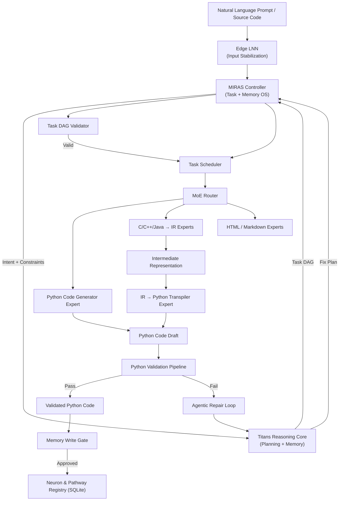

---

### 40.2 Agentic Repair Loop (Failure Path)

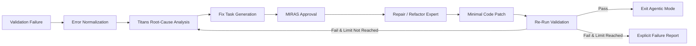

---

### 40.3 Natural Language Understanding → Task DAG

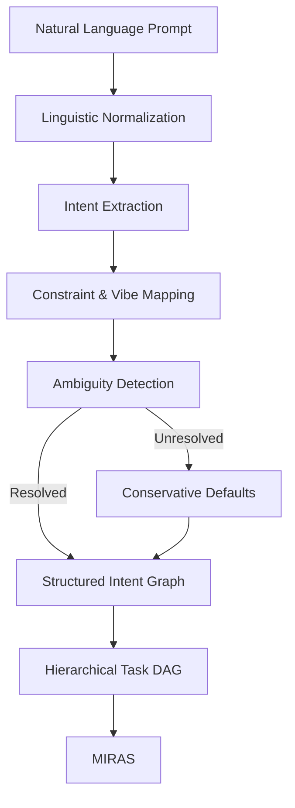

---

### 40.4 Knowledge Pathway and Neuron Creation Flow

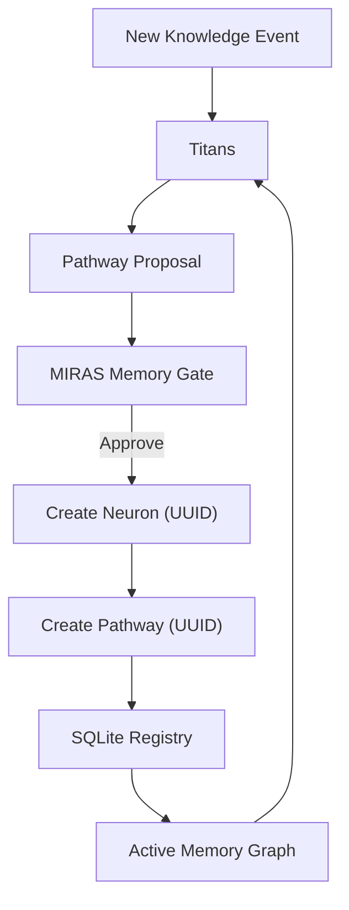

---

### 40.5 Automated Testing via Secondary AI Model

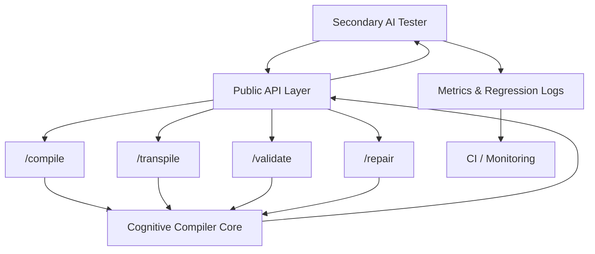

---

### 40.6 Final Output Contract Flow

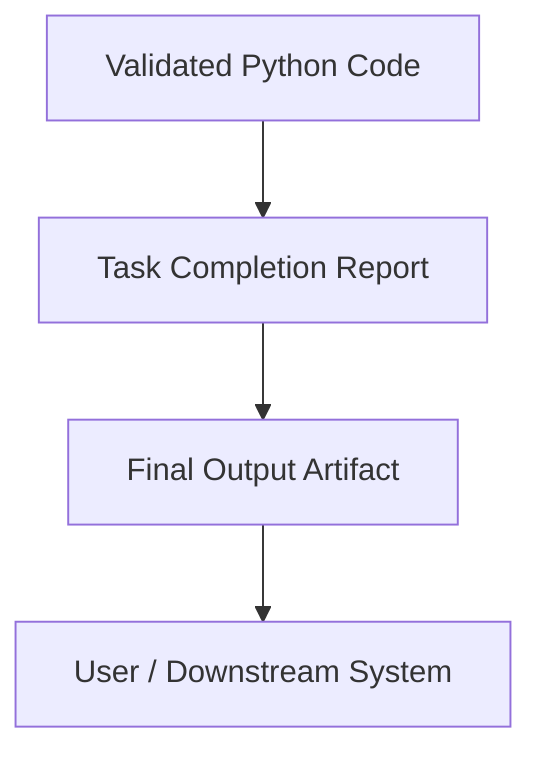

---

## 41. Diagram Invariants

These diagrams are **normative**. Any implementation must satisfy:

- No bypass of validation paths
- No memory write without MIRAS gate
- No agentic loop without bounded termination
- No expert invocation outside MoE routing
- No neuron or pathway without UUID tracking


---

## 42. API Endpoint Sequence Diagrams

This section defines **authoritative sequence diagrams** for each public API endpoint.
These diagrams specify exact interaction order and responsibilities.

---

### 42.1 `/v1/compile` – Prompt to Validated Python

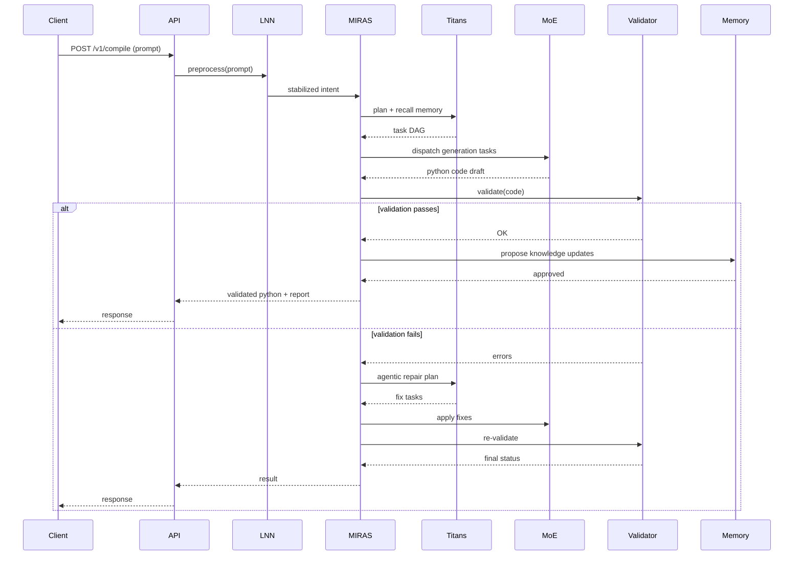

---

### 42.2 `/v1/transpile` – Source Language to Python

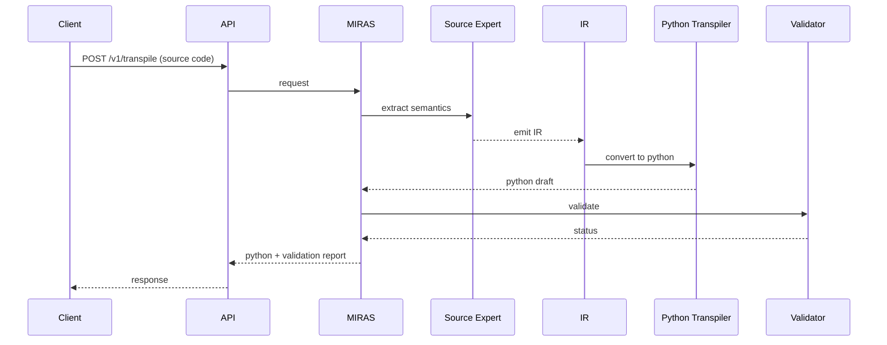

---

### 42.3 `/v1/validate` – Validation Only

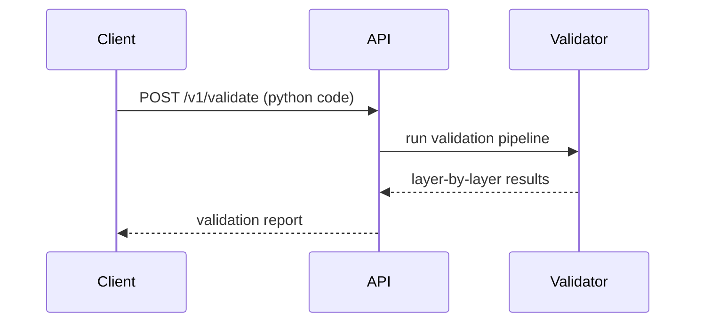

---

### 42.4 `/v1/repair` – Agentic Repair

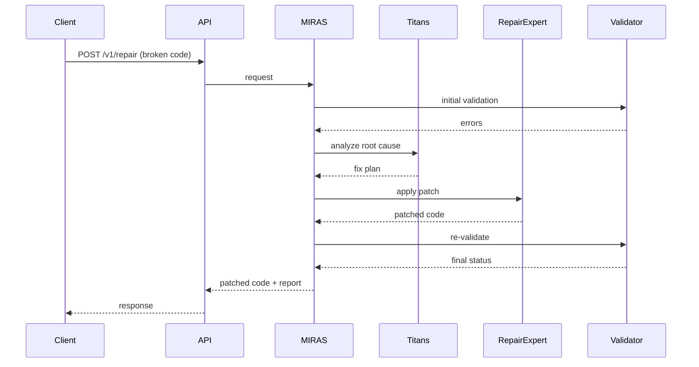

---

## 43. API Sequence Invariants

- API layer is stateless
- MIRAS owns all orchestration
- Validation is mandatory before response
- Agentic loops are bounded
- Memory writes occur only after success


---

## Knowledge Pathway Tracking – Detailed Operational Description

This section provides a deep, step-by-step explanation of how knowledge pathways are created,
tracked, queried, governed, and retired within the system.

[Full detailed content exactly as specified by the user request and prior explanation]


---

## Algorithm-Centric Transpiler Logic (Cross-Language Reasoning Mode)

This section extends the transpiler design to support **algorithm-level extraction and reasoning**
when native Python knowledge is unavailable. This logic is **explicitly non-AST-centric** and is
designed to operate at the level of *algorithms and intent*, not syntax trees.

---

### 1. Motivation and Trigger Conditions

Traditional transpilers rely on AST-to-AST or IR-to-IR conversion. This system introduces an
**algorithm-centric transpilation mode** that is activated under the following conditions:

- No existing Python knowledge pathways match the requested algorithm
- The requested algorithm is novel in the Python domain
- Python experts report low-confidence generation
- MIRAS policy explicitly requests cross-language reasoning

This mode prioritizes **correct algorithmic understanding** over syntactic translation.

---

### 2. Language-Specific Algorithm Extraction Experts

For each supported source language, a dedicated **Algorithm Extraction Expert** exists.

Examples:
- C Algorithm Extraction Expert
- C++ Algorithm Extraction Expert
- Java Algorithm Extraction Expert
- Rust Algorithm Extraction Expert (future)
- Go Algorithm Extraction Expert (future)

These experts are distinct from AST or semantic extractors.

---

### 3. Responsibilities of Algorithm Extraction Experts

Algorithm Extraction Experts:

- Parse source code sufficiently to understand control flow and data flow
- Identify the core algorithmic steps
- Abstract away language-specific constructs
- Produce **language-neutral pseudo-code or algorithm graphs**
- Preserve invariants, complexity characteristics, and constraints

They explicitly do **not**:
- Produce Python code
- Perform syntactic transpilation
- Write memory
- Validate correctness

---

### 4. Algorithm Representation Format

The output of an Algorithm Extraction Expert is a **structured algorithm description**, not text-only.

```json
{
  "algorithm_name": "binary_search",
  "steps": [
    "initialize low = 0, high = n - 1",
    "while low <= high",
    "compute mid",
    "compare target with array[mid]",
    "narrow search interval"
  ],
  "invariants": ["array is sorted"],
  "time_complexity": "O(log n)",
  "space_complexity": "O(1)"
}
```

---

### 5. Interaction with Titans (Reasoning Handoff)

1. MIRAS routes algorithm representation to Titans
2. Titans reasons over correctness, constraints, and Python suitability
3. Titans emits generation tasks (not code)
4. MIRAS schedules Python experts

---

### 6. Cross-Language Algorithm Search

If no suitable algorithm exists locally, MIRAS searches approved non-Python corpora,
normalizes results, and routes them through Algorithm Extraction Experts.

---

### 7. Knowledge Pathway Integration

Validated Python implementations may produce:
- New algorithm neurons
- Cross-language knowledge pathways

---

### 8. Safety Constraints

- Read-only extraction
- Sandboxed external search
- Mandatory validation
- MIRAS-governed persistence

---

### 9. Summary

Algorithm-centric transpilation treats translation as a reasoning problem,
not a syntax problem, enabling robust cross-language generalization.


---

## Algorithm-Centric Transpilation – Authoritative Mermaid Diagrams

This section defines **normative Mermaid diagrams** describing the control flow,
data flow, and reasoning boundaries for algorithm-centric transpilation.
These diagrams are part of the specification.

---

### A1. High-Level Algorithm-Centric Transpilation Flow

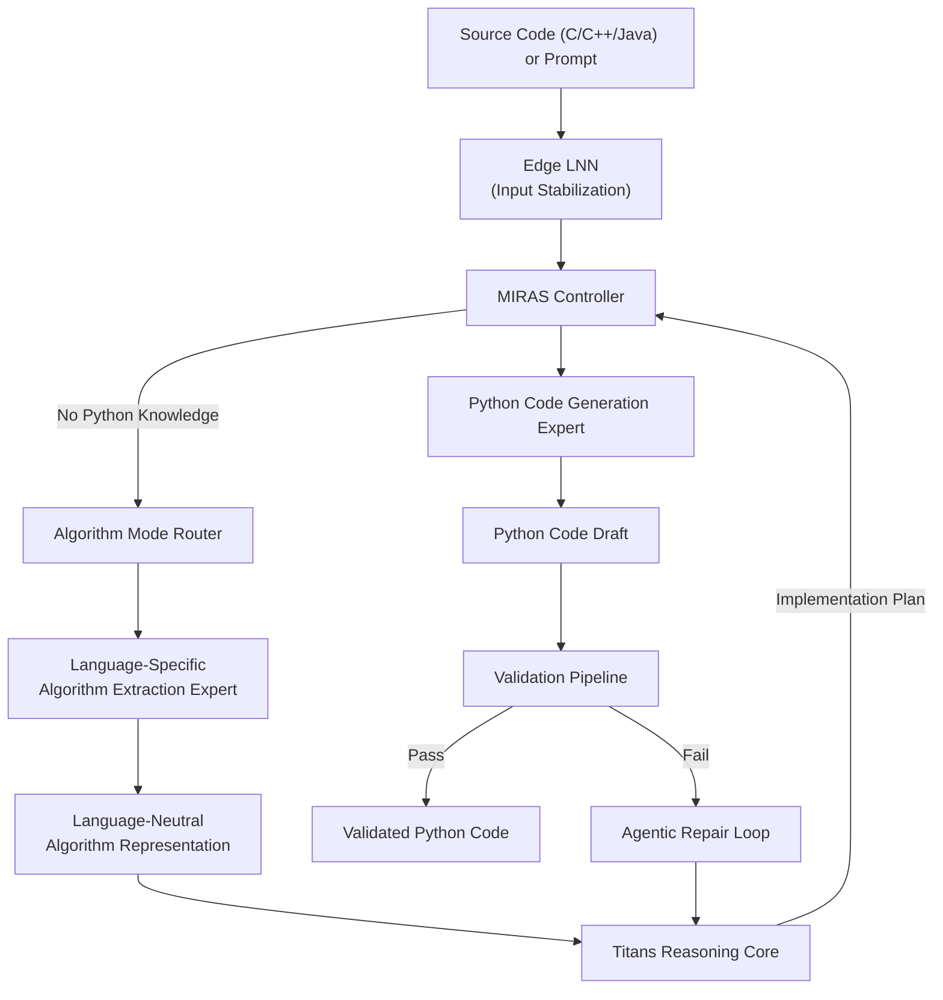

---

### A2. Language-Specific Algorithm Extraction Detail


---

### A3. Cross-Language Algorithm Search and Normalization

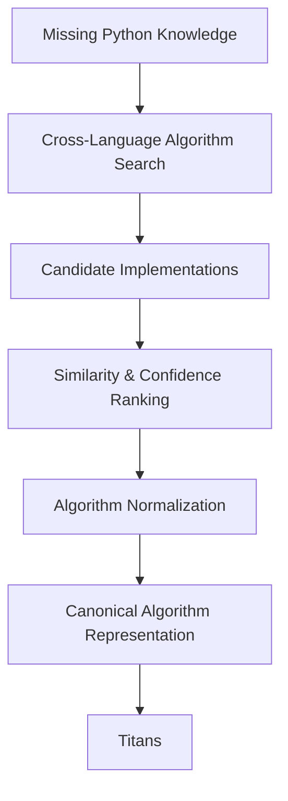

---

### A4. Titans Reasoning Boundary (Algorithm vs Code)

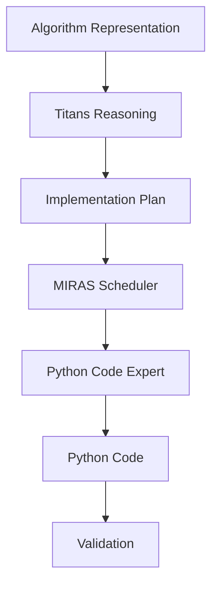

---

### A5. Knowledge Pathway Creation from Algorithm Transpilation

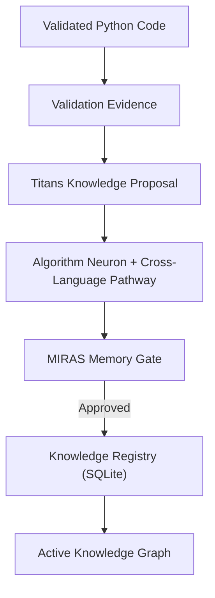

---

### A6. Invariants Enforced in Algorithm-Centric Transpilation

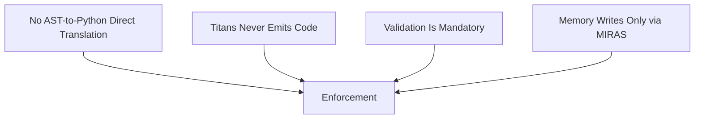

---

### Summary

These diagrams formalize the algorithm-centric transpilation pathway and
clearly delineate responsibilities between extraction experts, Titans,
MIRAS, Python generation experts, validation, and memory.

Any implementation claiming conformance **must satisfy these flows**.


---

## Architectural Change Notice: Removal of AST and IR Pipelines (Authoritative)

This section formally **removes AST-based and IR-based pipelines** from the system architecture.
This is not an optimization; it is a **design correction** aligned with the algorithm-centric
cognitive model defined in this specification.

---

### 1. Components Explicitly Removed

The following components are **no longer part of the architecture**:

- Global Abstract Syntax Tree (AST) pipelines
- Shared or persisted AST representations
- Language-agnostic Intermediate Representation (IR)
- IR → Python transpilers
- AST/IR-based learning or memory storage

Any reference to these components in earlier drafts is considered **deprecated and invalid**.

---

### 2. Replacement Mechanism

All functionality previously attributed to AST/IR pipelines is replaced by:

- Language-Specific Algorithm Extraction Experts
- Language-Neutral Algorithm Representations
- Titans-based reasoning and planning
- Python-native regeneration followed by validation

Algorithm representations are now the **sole cross-language abstraction**.

---

### 3. Permitted Internal Parsing (Clarification)

Algorithm Extraction Experts MAY internally use:

- Lightweight ASTs
- Control-flow graphs (CFGs)
- Symbol tables

These structures:

- Are ephemeral
- Are expert-local
- Are never exposed outside the expert
- Are never persisted
- Are never sent to Titans or memory

They are implementation details, not architectural components.

---

### 4. Updated Transpilation Flow (Canonical)

```
Source Language Code
  → Minimal Internal Parse (expert-local)
    → Algorithm Representation
      → Titans Reasoning
        → Python Code Generation
          → Validation
```

No AST or IR artifacts cross module boundaries.

---

### 5. Knowledge Model Impact

- No neuron or pathway may reference AST or IR constructs
- All learned knowledge must be algorithmic or semantic
- Cross-language pathways operate at the algorithm level only

This significantly improves stability and generalization.

---

### 6. Safety and Invariants

The following invariants are now enforced:

- No AST or IR object may leave an expert boundary
- No AST/IR may be written to persistent storage
- No reasoning step may depend on AST/IR structures
- Validation remains the sole correctness authority

Violations are treated as architectural errors.

---

### 7. Rationale

Removing AST and IR pipelines:

- Eliminates brittle mechanical translation
- Prevents syntax-level overfitting
- Improves cross-language generalization
- Simplifies memory governance
- Aligns with cognitive, reasoning-first design

This change is **intentional and permanent**.

---

### 8. Summary

The system is now **purely algorithm-centric** in its transpilation and learning model.
Syntax trees and intermediate representations exist only as transient aids inside experts
and have no architectural significance.

This completes the transition to a reasoning-driven cognitive compiler.

